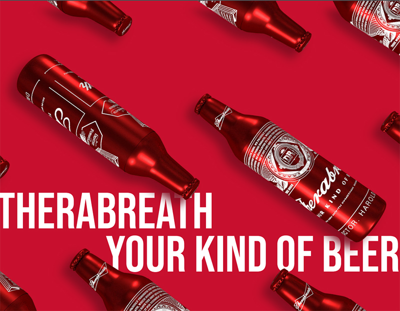

# Final Integrated Project :page_facing_up:

## Create a 5-page responsive website for the assigned coherent beer brand. :beer:

### Prerequisites

To see this project, clone it and open `index.html` with a [browser](https://www.google.com/chrome/) that works well with responsive designs.

To view our Roadmap for this project, click [here](https://docs.google.com/document/d/1Uh4-_7EEtK07nYwV0pA6GJO_X9-JPdzIEDwVTaEjhd4/edit?usp=sharing)

### Team Members
- My Tu Tran (Evan): Developer :sunglasses:
- Jiheui Yu: Designer	:relaxed:

### License

MyTuTran & JiheuiYu :copyright: 2020# Therabreath_Budweiser_Beer
